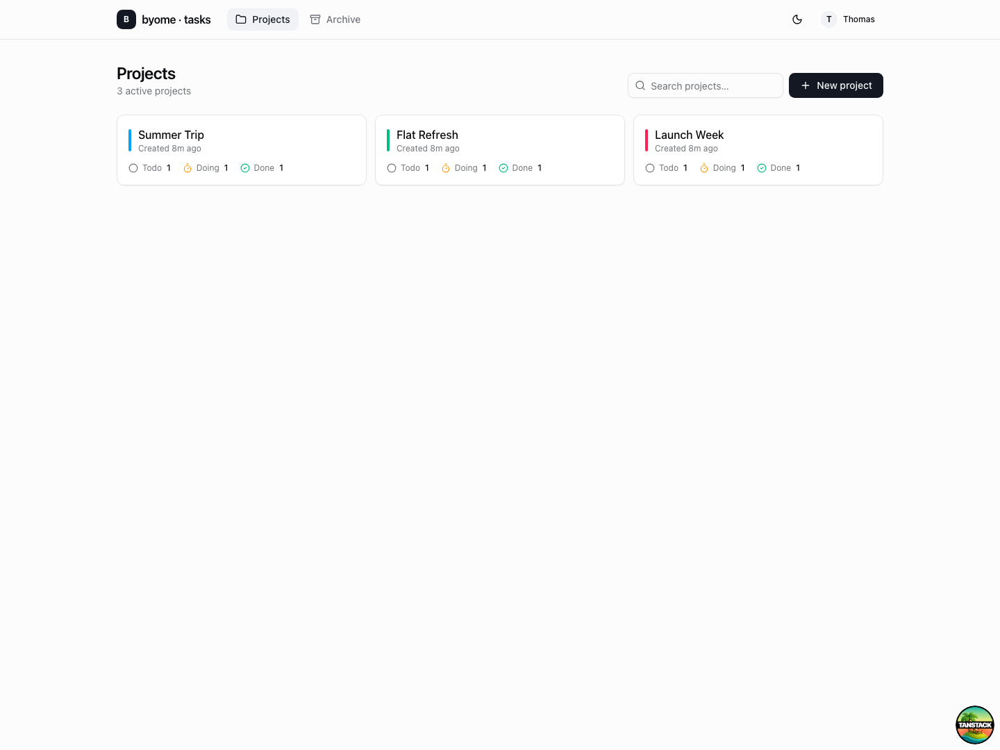
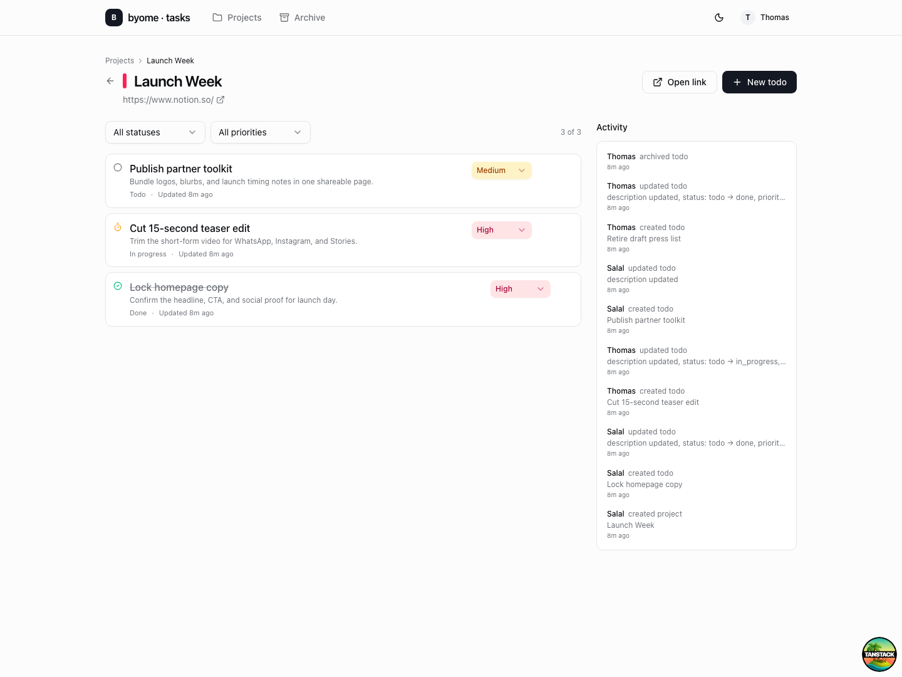
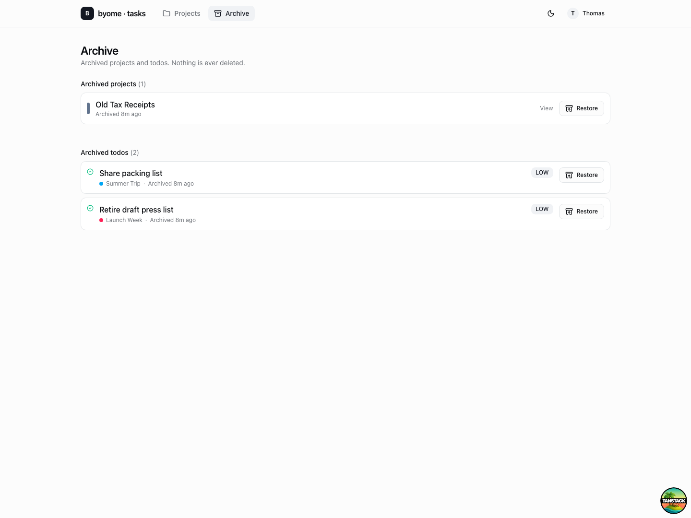

# byome · tasks

Shared task management for two people who want something lighter than Jira and
less chaotic than a WhatsApp thread.

Create projects, track todos, see who changed what, and archive anything
without losing history.

## What it does

- Keeps projects and todos in one simple shared workspace.
- Tracks status, priority, descriptions, and recent activity.
- Preserves everything through an archive instead of delete flow.
- Updates live for everyone connected to the app.

## Inside the app

The project view combines task filters, quick status updates, and a running
activity feed so it is obvious what changed and who changed it.

Archived projects and todos stay one click away from being restored, which
makes the app safe to use as an everyday shared system rather than a brittle
checklist.

## Getting started

Setup, local development, deployment, scripts, and architecture are documented
in [GETTING_STARTED.md](./GETTING_STARTED.md).
